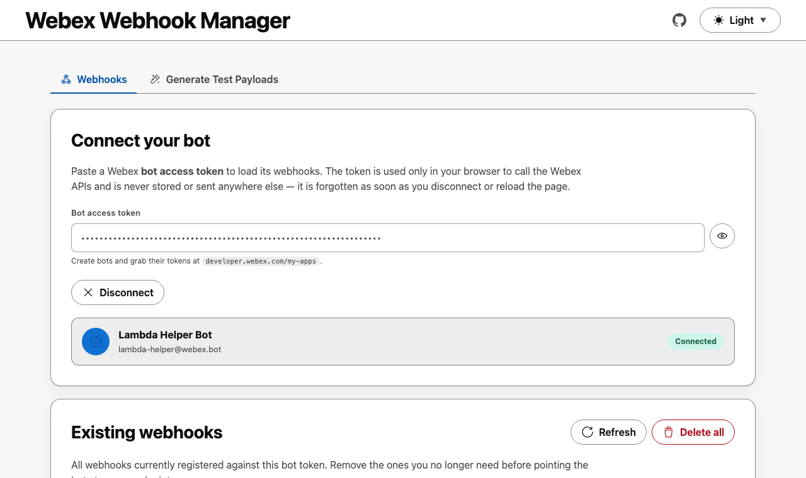
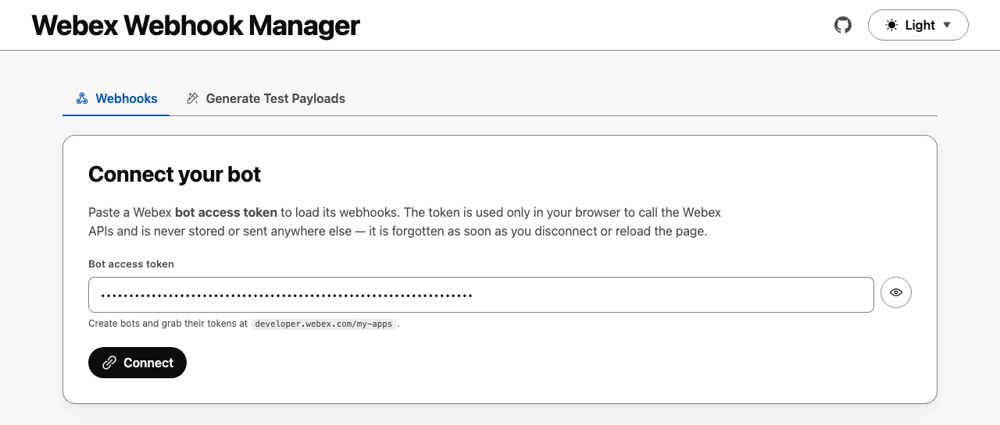
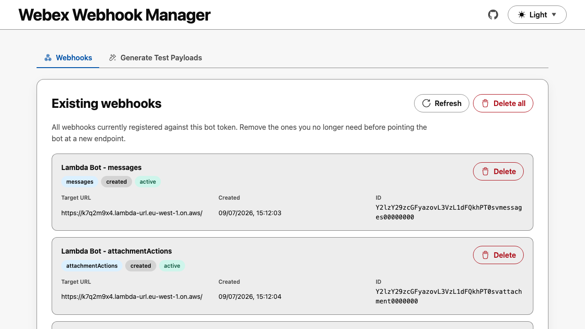
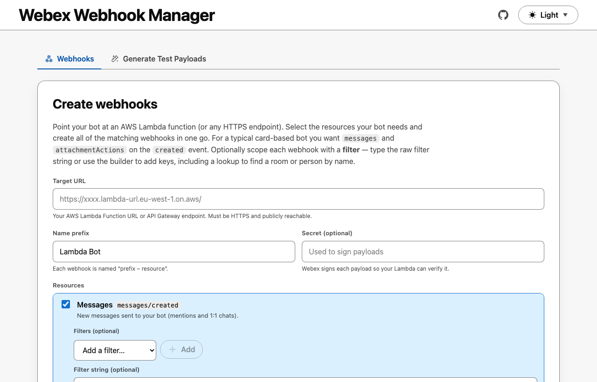
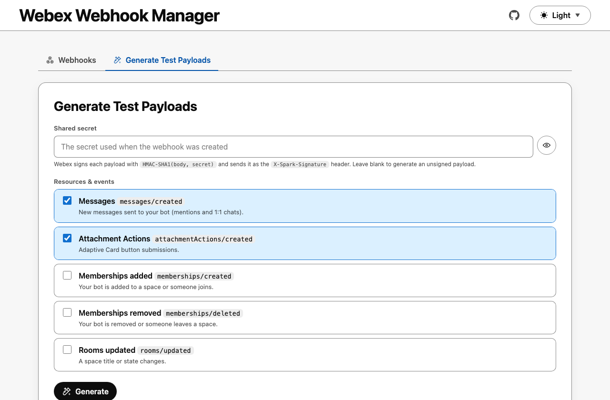
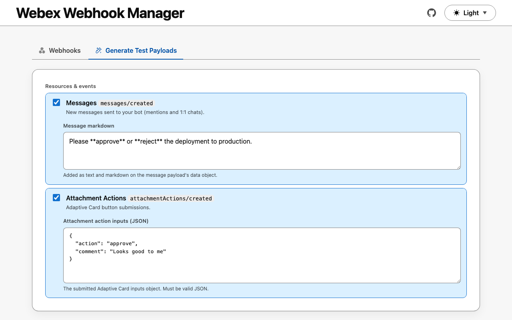
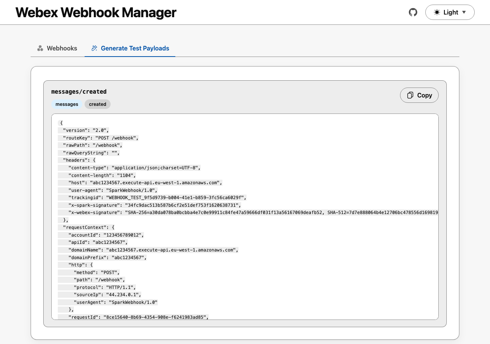
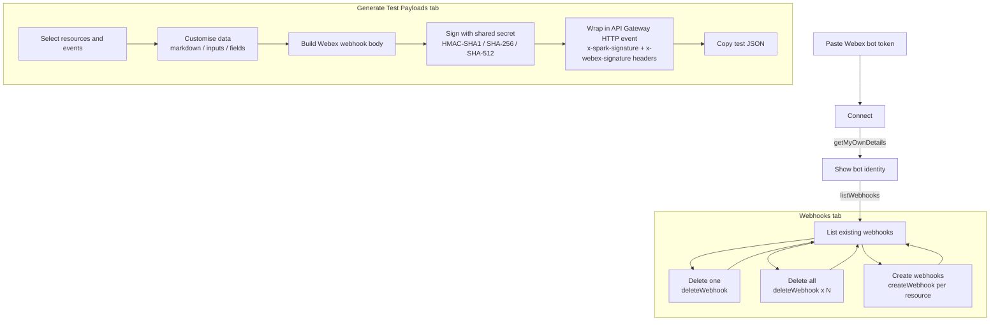

# Webex Webhook Manager

A lightweight, browser-based tool for managing a Webex bot's webhooks and generating signed test events for its webhook handler.

Paste a Webex bot token to instantly review, delete, and (re)create the bot's webhooks — no scripts, cURL, or Postman collections required. It also builds ready-to-paste, HMAC-signed AWS Lambda test events so you can validate your bot's webhook handler without waiting for a real Webex delivery. It's built for Webex bot developers who host their bot on AWS Lambda (or any HTTPS endpoint) and want to iterate quickly. Everything runs client-side — your bot token and shared secret never leave the browser.

 <a href="https://wxsd-sales.github.io/webex-webhook-manager">
  <picture>
    <source media="(prefers-color-scheme: dark)" srcset="screenshots/connected-dark.png">
    <source media="(prefers-color-scheme: light)" srcset="screenshots/connected-light.png">
    
  </picture>
</a>

## Overview

The app is a single static page split into two tabs — **Webhooks** and **Generate Test Payloads** — and talks to the [Webex REST API](https://developer.webex.com/docs/api/v1/webhooks) directly from your browser using the bot token you provide. There is no backend and nothing is stored: reload the page and the token is gone.

> **Where do I get a bot token?** Sign in at [developer.webex.com/my-apps](https://developer.webex.com/my-apps) → **Create a New App** → **Create a Bot**. Once created, copy the **Bot Access Token** shown on the confirmation page (it's only shown once). Paste that token into the app.

### Create and Manage Webhooks

Review, delete, and create a bot's Webex webhooks using its access token — handy for repointing a bot at a new endpoint or clearing out stale webhooks.

1. Enter your Webex bot access token and click **Connect**.

<a href="https://wxsd-sales.github.io/webex-webhook-manager">
<picture>
<source media="(prefers-color-scheme: dark)" srcset="screenshots/enterToken-dark.png">
<source media="(prefers-color-scheme: light)" srcset="screenshots/enterToken-light.png">

</picture>
</a>

2. The app fetches the identity associated with the token (via `getMyOwnDetails`) and displays the bot's name and email so you can confirm you're managing the right bot.

<a href="https://wxsd-sales.github.io/webex-webhook-manager">
<picture>
    <source media="(prefers-color-scheme: dark)" srcset="screenshots/connected-dark.png">
    <source media="(prefers-color-scheme: light)" srcset="screenshots/connected-light.png">
    
</picture>
</a>

3. Review every webhook registered against the token, then delete them individually or clear them all with one click.

<a href="https://wxsd-sales.github.io/webex-webhook-manager">
  <picture>
    <source media="(prefers-color-scheme: dark)" srcset="screenshots/existingWebhooks-dark.png">
    <source media="(prefers-color-scheme: light)" srcset="screenshots/existingWebhooks-light.png">
    
  </picture>
</a>

4. Create new webhooks in bulk. Pick the resource/event combinations your bot needs (e.g. `messages/created`, `attachmentActions/created`), point them at your target URL, and optionally set a signing secret — one webhook is created per selected resource.

 <a href="https://wxsd-sales.github.io/webex-webhook-manager">
  <picture>
    <source media="(prefers-color-scheme: dark)" srcset="screenshots/createWebhooks-dark.png">
    <source media="(prefers-color-scheme: light)" srcset="screenshots/createWebhooks-light.png">
    
  </picture>
</a>

### Generate Lambda Function Tests

AWS Lambda functions are an ideal place to process Webex bot webhook notifications and respond to the messages or card actions sent to your bot. This tab generates realistic, signed test events for each webhook resource so you can validate your Lambda handler — including its signature verification — without waiting for a real Webex delivery.

1. Open the **Generate Test Payloads** tab and select the webhook resource/event types you want to test.
    - Enter the same **shared secret** you used when creating the webhook so each payload's signature headers are calculated correctly: `x-spark-signature` (an `HMAC-SHA1` of the body) and `x-webex-signature` (the `HMAC-SHA256` and `HMAC-SHA512` digests, formatted as `SHA-256=<hex>, SHA-512=<hex>`). Leave it blank to produce an unsigned payload.

 <a href="https://wxsd-sales.github.io/webex-webhook-manager">
  <picture>
    <source media="(prefers-color-scheme: dark)" srcset="screenshots/generateTests-dark.png">
    <source media="(prefers-color-scheme: light)" srcset="screenshots/generateTests-light.png">
    
  </picture>
</a>

2. Customise each selected resource's data using the inline fields that appear beneath it — for example the message markdown for `messages`, or the submitted card `inputs` (JSON) for `attachmentActions`.

 <a href="https://wxsd-sales.github.io/webex-webhook-manager">
  <picture>
    <source media="(prefers-color-scheme: dark)" srcset="screenshots/customiseTest-dark.png">
    <source media="(prefers-color-scheme: light)" srcset="screenshots/customiseTest-light.png">
    
  </picture>
</a>

3. Click **Generate** and copy the resulting test event(s) into your AWS Lambda function's test console. Each event is a complete **API Gateway HTTP API (payload format 2.0)** request, with the signature already set in the headers.

 <a href="https://wxsd-sales.github.io/webex-webhook-manager">
  <picture>
    <source media="(prefers-color-scheme: dark)" srcset="screenshots/exampleTextJson-dark.png">
    <source media="(prefers-color-scheme: light)" srcset="screenshots/exampleTextJson-light.png">
    
  </picture>
</a>

### Flow Diagram

<details>
    <summary>Click here to view flow diagram</summary>



All Webex API calls (`getMyOwnDetails`, `listWebhooks`, `createWebhook`, `deleteWebhook`) run from the browser. The **Generate Test Payloads** tab is entirely local — it never contacts Webex and works without connecting a token.

</details>


## Setup

You don't need to install anything to _use_ the app — just open the [hosted demo](https://wxsd-sales.github.io/webex-webhook-manager) and paste your bot token. The steps below are for running it locally or hosting your own copy.

> [!IMPORTANT]
> The app calls the Webex API from the browser, and Webex only accepts those cross-origin (CORS) requests from a valid web origin. This has two consequences:
>
> - **You cannot open `index.html` as a `file://` page, and you cannot host it on a bare IP address.** It must be served over HTTP(S) from a proper, fully-qualified domain name (FQDN) — e.g. `https://your-name.github.io/...`.
> - **`localhost` is not an FQDN**, so the browser blocks direct calls to the Webex API during local development. The included dev proxy is therefore **required** when running locally — the app automatically routes API calls through it on `localhost` / `127.0.0.1`.

### Prerequisites & Dependencies

- A **Webex bot** and its **access token** — create one at [developer.webex.com/my-apps](https://developer.webex.com/my-apps) (see [Overview](#overview) above).
- **Node.js 18+** — needed to run the local dev proxy and static server (and to regenerate screenshots). The app itself is plain static HTML/CSS/JS with **no runtime dependencies** and no build step.
- A **static web host with a real domain and HTTPS** for deployment — e.g. GitHub Pages, Netlify, Vercel, or S3 + CloudFront. Hosting from a raw IP address or opening the file directly will not work.
- **Google Chrome / Chromium** — only required if you want to run `npm run screenshot:web` to regenerate the screenshots.

### Installation Steps

1. Fork this repository (so you get your own GitHub Pages URL), then clone your fork:

   ```sh
   git clone https://github.com/<your-username>/webex-webhook-manager.git
   cd webex-webhook-manager
   ```

2. **Run it locally (the dev proxy is required).** Because `localhost` isn't an FQDN, the browser blocks direct calls to the Webex API, so the app routes them through a small proxy. Run each command in its own terminal and leave both running:

   ```sh
   npm run dev:proxy   # required — proxies the Webex API on http://127.0.0.1:8787
   npm run serve:web   # serves the app on http://127.0.0.1:4173
   ```

   Then open <http://127.0.0.1:4173>. On `localhost` / `127.0.0.1` the app automatically sends its Webex API calls through the proxy; if the proxy isn't running, connecting will fail.

3. **Host your own copy (needs a real domain).** The app is fully static, so just publish the repo root (`index.html`, `styles.css`, and `scripts/`) to an HTTPS domain:

   - **GitHub Pages:** push to your fork, then go to **Settings → Pages → Build and deployment**, choose **Deploy from a branch**, and select `main` / `/ (root)`. Your copy will be live at `https://<your-username>.github.io/webex-webhook-manager`.
   - **Any other static host:** upload the same files to Netlify, Vercel, S3 + CloudFront, etc.

   When served from a proper HTTPS domain, the app calls the Webex API directly from the browser — no proxy is needed in production. It will **not** work from a `file://` path or a bare IP address.

## Demo

Check out our live demo, available [here](https://wxsd-sales.github.io/webex-webhook-manager)!

\*For more demos & PoCs like this, check out our [Webex Labs site](https://collabtoolbox.cisco.com/webex-labs).

## License

All contents are licensed under the MIT license. Please see [license](LICENSE) for details.

## Disclaimer

Everything included is for demo and Proof of Concept purposes only. Use of the site is solely at your own risk. This site may contain links to third party content, which we do not warrant, endorse, or assume liability for. These demos are for Cisco Webex usecases, but are not Official Cisco Webex Branded demos.

## Questions

Please contact the WXSD team at [wxsd@external.cisco.com](mailto:wxsd@external.cisco.com?subject=webex-webhook-manager) for questions. Or, if you're a Cisco internal employee, reach out to us on the Webex App via our bot (globalexpert@webex.bot). In the "Engagement Type" field, choose the "API/SDK Proof of Concept Integration Development" option to make sure you reach our team.
